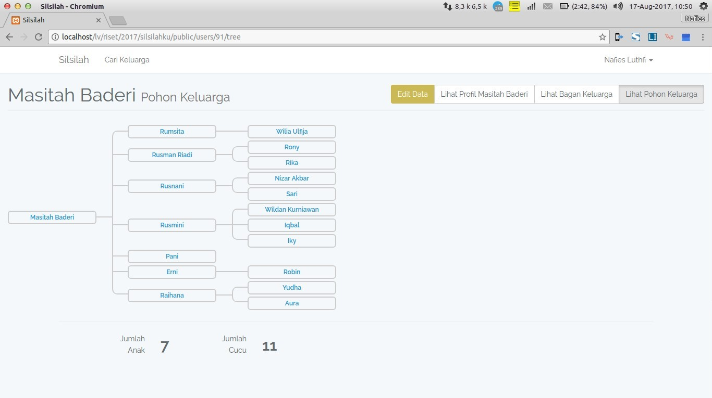
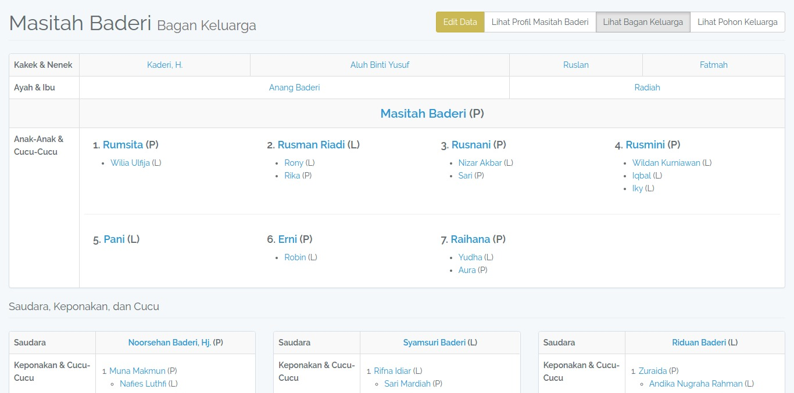
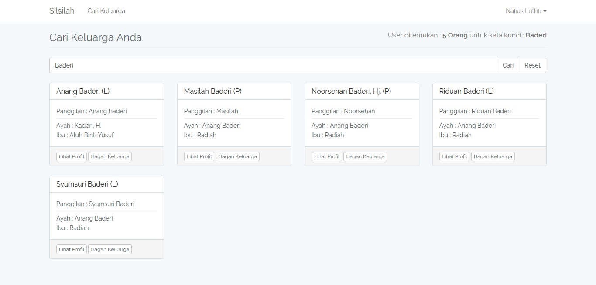
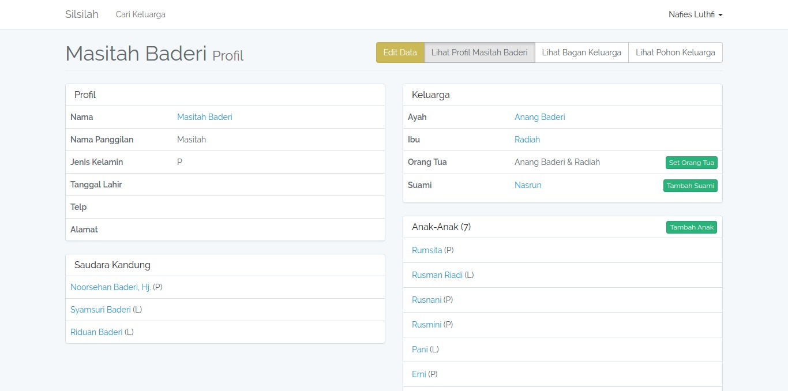
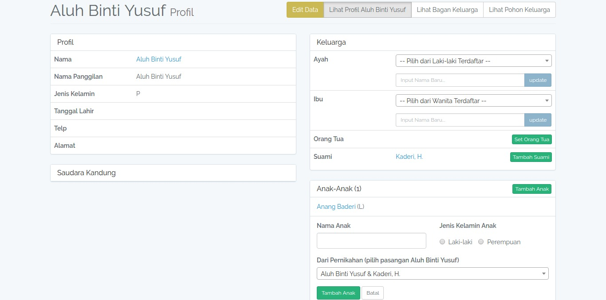
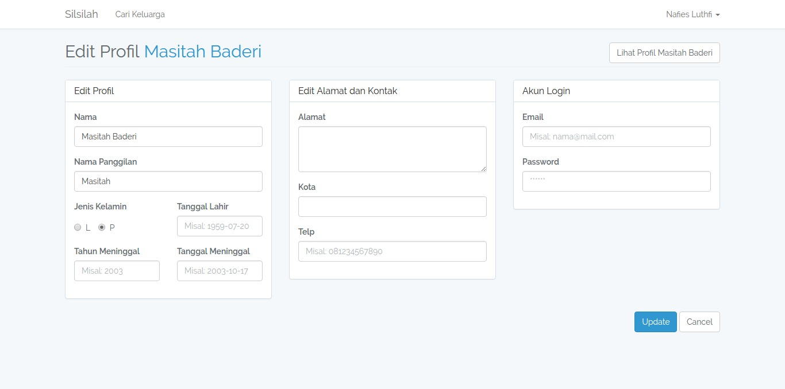
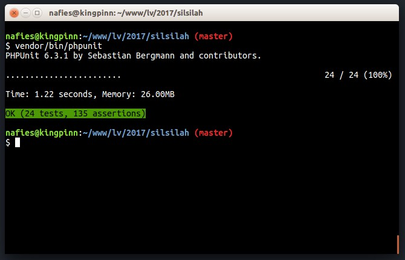

# Aplikasi Silsilah Keluarga

[English](README.md) | Indonesia


[](https://travis-ci.org/nafiesl/silsilah)
[](https://coveralls.io/github/nafiesl/silsilah?branch=master)

> **⚠️ Development in progress**  
> Dalam proses development, perubahan struktur tabel akan **diubah langsung pada file migration** yang sesuai.

## Tentang

Aplikasi silsilah keluarga untuk mempermudah pendataan keluarga kita.

## Pemanfaatan

1. Melihat silsilah keluarga
2. Melihat data ahli waris

## Fitur

Aplikasi ini menggunakan Bahasa Indonesia dan Bahasa Inggris, diatur pada `config.locale`.

### Konsep

1. Satu orang memiliki satu ayah (belum sebagai tentu orang tua)
2. Satu orang memiliki satu ibu (belum sebagai tentu orang tua)
3. satu orang memiliki satu orang tua
4. Satu orang memiliki 0 s/d beberapa anak
5. Satu orang bisa memiliki pasangan (Istri/Suami)
6. Satu pasangan bisa memiliki 0 s/d beberapa anak
7. Satu orang laki-laki bisa memiliki maksimal 4 pasangan yang tidak cerai (TODO)
8. Satu orang perempuan bisa memiliki maksimal 1 pasangan yang tidak cerai (TODO)
9. Satu orang perempuan yang suaminya meninggal otomatis set tanggal cerai (pada data pasangan) (TODO)

### Input ke sistem

1. Input Nama dan Jenis Kelamin
2. Tambah Ayah
3. Tambah Ibu
4. Tambah Pasangan
5. Tambah Anak

### Data Orang

1. Nama Panggilan
2. Jenis Kelamin
3. Nama Lengkap
4. Tanggal Lahir
5. Tanggal Meninggal (atau cukup tahun)
6. Alamat
7. Telp
8. Email

### Data Pasangan (TODO)

1. Suami
2. Istri
3. Tanggal menikah
4. Tanggal Cerai
5. Alamat

## Cara Install

### Kebutuhan Server

Aplikasi ini dapat dipasang pada server lokal dan onlne dengan spesifikasi berikut:

1. PHP 7.3 (dan mengikuti [server requirements Laravel 8.x](https://laravel.com/docs/8.x/deployment#server-requirements) lainnya),
2. Database MySQL atau MariaDB,
3. SQlite (untuk automated testing).

### Instalasi Manual

1. Clone repo dan pindah ke direktori aplikasi:

    ```bash
    git clone https://github.com/nafiesl/silsilah.git
    cd silsilah
    ```

2. Instal dependensi:

    ```bash
    composer install
    ```

3. Buat file `.env`:

    ```bash
    cp .env.example .env
    ```

4. Generate key aplikasi:

    ```bash
    php artisan key:generate
    ```

5. Setup database dan sesuaikan konfigurasi *environment variable* lainnya pada file `.env`.

6. Tambahkan email admin pada file `.env` (Opsional):

    ```bash
    SYSTEM_ADMIN_EMAILS=admin@email.com;other_admin@email.com
    ```

7. Migrate database dan link storage:

    ```bash
    php artisan migrate
    php artisan storage:link
    ```

8. Jalankan aplikasi:

    ```bash
    php artisan serve --host 0.0.0.0  --port=8000
    ```

Buka aplikasi pada browser dengan alamat <http://localhost:8000>.

### Instalasi Menggunakan Docker

Pastikan Docker dan Docker Compose sudah terinstall.

```bash
make run-docker
```

or

```bash
docker-compose up -d
```

Buka aplikasi pada browser dengan alamat <http://localhost:8000>.

### Testing

Jalankan automated testing dengan perintah berikut:

```bash
vendor/bin/phpunit
```

## Screenshots

### Pohon Keluarga



Tampilan pohon keluarga ini menggunakan [Horizontal Family Tree CSS](https://codepen.io/P233/pen/Kzbsi), terima kasih kepada [Peiwen Lu](https://codepen.io/P233/pen/Kzbsi).

### Bagan Keluarga



### Cari Keluarga



### Profil



### Form Profil



### Edit Profil



### Automated Testing



## License

Project Silsilah merupakan software open-source di bawah lisensi [Lisensi MIT](LICENSE).
